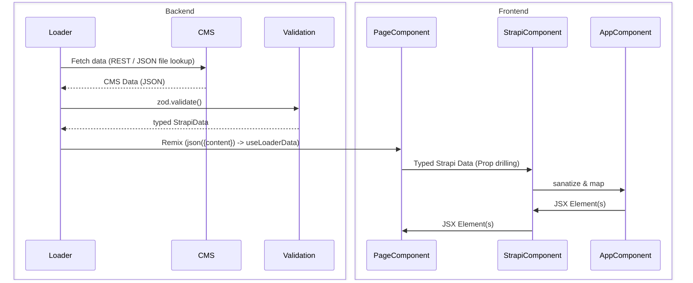
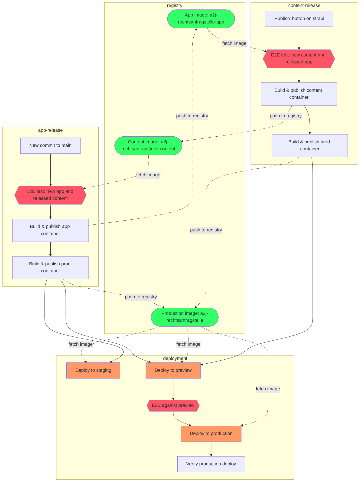

# A2J - Digitale Rechtsantragstelle

First draft of implementing a platform to create requests to the Rechtsantragstelle.

[interactive code map](https://mango-dune-07a8b7110.1.azurestaticapps.net/?repo=digitalservicebund%2Fa2j-rechtsantragstelle)

## Development

### Requirements

- Node.js LTS (currently v22)
- Docker (Redis dependency)
- npm 7 or greater
- strapi ([see below](#strapi))

#### Strapi

<details>
<summary>Three options:</summary>

1. A local strapi instance:
   - [Start strapi locally](https://github.com/digitalservicebund/a2j-rechtsantragstelle-strapi),
   - configure `.env` with `CMS=STRAPI` and `STRAPI_API` pointing to your local strapi instance (`cp .env.example .env` should do the trick)
2. Using the the deployed staging strapi instance:
   - Set `STRAPI_API=<STRAPI_STAGING_URL>/api` and set `STRAPI_ACCESS_KEY` to your token
     - create a new token (access key) in the strapi GUI at "Settings" > "API Tokens" > "Create new API Token"
     - set the token type to **read-only**
3. Use a local content file:
   - Set `STRAPI_API` and `STRAPI_ACCESS_KEY` to point to staging like in option 2.
   - Set `CMS=FILE`
   - Run `npm run build:localContent` (should have generated a `content.json` file)

</details>

##### Locales

For each Strapi page, there are two locales: **Staging (sg)** and **Production (de)**.
This is because while we're able to feature flag code changes in PostHog, we aren't able to feature flag _content_ changes in the CMS. E.g. If we want to test out _content_ changes, like different components on the same page, we must use Strapi's Locale feature, as Multi-Environments is only supported by [Strapi Cloud](https://github.com/strapi/documentation/pull/2229).

The App first checks to [see if valid staging data exists](https://github.com/digitalservicebund/a2j-rechtsantragstelle/blob/9b242255fefc4917abbf97a297229b828d9a2ef5/app/services/cms/getStrapiEntryFromApi.ts#L47), and if not, [pull the requested data from the production environment](https://github.com/digitalservicebund/a2j-rechtsantragstelle/blob/9b242255fefc4917abbf97a297229b828d9a2ef5/app/services/cms/getStrapiEntryFromApi.ts#L56-L57). By default, we develop features in the Production environment.

### Run Server in Development Mode

```sh
npm install
docker compose up -d
npm run dev
```

This starts your app in development mode, rebuilding assets on file changes.
Open the app in `localhost:3000`

### Tests

#### Unit tests

- run: `npm run test`
- run in [watch mode](https://vitest.dev/guide/features.html#watch-mode): `npm run test:watch`
- run with coverage: `npm run test:coverage`
- run subset: `npm run test -- -t "STRING_TO_MATCH"`

#### E2E tests

- run: `npm run test:e2e`
- UI: `npm run test:e2e:ui`
- debug (F10 to step over): `npx playwright test --debug`

> **Note**
>
> Remember to install playwright cli and set the environment variable GERICHTSFINDER_ENCRYPTION_KEY.

#### Write E2E tests

- [getting started](https://playwright.dev/docs/writing-tests) writing tests
- use [codegen](https://playwright.dev/docs/codegen-intro) as an aid: `npx playwright codegen localhost:3000/kitchensink`

#### Debug E2E tests in CI

1. download `playwright-report.zip` artifact from GitHub action summary page (only present on e2e failure for 30 days)
2. unzip
3. `npx playwright show-trace <DOWNLOAD_PATH>/data/<HASH>.zip`

### Git Hooks

We use [lefthook](https://github.com/evilmartians/lefthook) for running several pre-commit hooks,install them using `npm run init`.

The git hooks check formatting, linting, unit tests, typecheck (see `lefthook.yaml` for more details). You may execute them before commiting using `lefthook run pre-commit`.

### How to add a new "Antrag" or form pdf to services/pdf/

1. Create a new folder for example: `prozesskostenhilfe`
2. Store the antrag or form pdf there: `prozesskostenhilfe/Erklaerung_Verhaeltnisse_Prozess_oder_Verfahrenskostenhilfe.pdf`
3. Run `npm run build:pdf`

After running the command, a new file named `prozesskostenhilfe.generated.ts` will be generated in the specified directory. You can use this file to fill out the PDF based on the input fields defined within it.

### How to generate TypeScript type declarations from xJustiz XSD's

In order to have type safety when generating an xJustiz XML at the end of an Antrag, we need to occasionally generate TypeScript type declarations from xJustiz XSD files.
**NOTE: the XSD files can be found at https://xjustiz.justiz.de/, and are not checked into the repository. You will need to download them and place them at `data/xml/schemas` to run the following script:**
Simply run `npm run build:typesFromXSD`. This manual command has you download and run `@wikipathways/cxsd`. We haven't added it as a dependency to our project, as it's several years out-of-date, and the generation shouldn't happen often.

- The generated TS files can be found at `data/xml/generated`, and due to issues with the underlying library, will need to have their imports renamed/fixed.
- You will also need to remove "junk" files, like `din-spec-XXX`, which aren't used.

### How to add a new Array page to a form flow (UNDER CONSTRUCTION)

(This section is still under construction, as there are still open questions about what the generic array case is [or should be] and how to document it)
Form flow arrays should, generally speaking, be defined like the following inside of `flow.json`:

```
"<Plural name>": {
   "initial": "<Plural name>-frage",
   "states": {
      "<Plural name>-frage": {
         "on":
            {
            "SUBMIT": [
               {
                  "guard": "hasOther<Plural name>",
                  "target": "uebersicht"
               }
            ],
            "BACK": "<Previous step>"
         }
      },
      "uebersicht": {
         "on": {
            "SUBMIT": [
               {
                  "guard": "hasOther<Plural name>AndEmptyArray",
                  "target": "warnung"
               }
            ],
            "BACK": "<Plural name>-frage",
            "add-<Plural name>": {
               "guard": "isValid<Plural name>ArrayIndex",
               "target": "<Singular name>"
            }
         }
      },
      "warnung": {
         "on": {
            "BACK": "uebersicht",
            "SUBMIT": "<Next Step>"
         }
      },
      "<Singular name>": {
         "initial": "daten",
         "states": {
            "daten": {
               "on": {
                  "BACK": "#<Plural name>.uebersicht",
                  "SUBMIT": "#<Plural name>.uebersicht"
               }
            }
         }
      }
   }
}
```

Note the following:

- The step begins with a `____-frage` step, usually a yes/no radio page, indicating whether or not to show the ArraySummary page at all. E.g. "Do you have any additional income you would like to report?"
- The `uebersicht` page is the ArraySummary, which will display all the items the user has added, along with an "Add item" button
- `warnung` is necessary as a type of form validation, to ensure that the user has entered >= 1 item (actual form validation would be tricky here, so displaying a warning to the user is the next best thing)
- Finally, the `<Singular name>` step is basically a placeholder for the data entered per item (`daten`), so that the url reads as `<Singular name>/<item number>/daten` e.g. `arbeitsausgabe/0/daten`

After these steps have been entered in `flow.json`, we need to define the matching `ArrayConfigServer` in `index.ts` of the respective flow:

```
config: _.merge(<flow>, {
   meta: {
      arrays: {
         <Plural name>: {
            url: "/<flowId>/<stepId>/<Plural name>/<Singular name>",
            initialInputUrl: "daten",
            event: "add-<Plural name>",
         },
      } satisfies Partial<Record<AllContextKeys, ArrayConfigServer>>,
   }
})
```

(If multiple `ArrayConfigServer`s are being added, it might be sensible to add them to an `arrayConfigurations.ts` file and spread them in)

### Data Flow



### Deployment

App and content are deployed seperately from each other. Refer to the following flow chart:



### Storybook

We have a storybook instance running. On the Staging and preview environments it can be accessed via `/storybook`.
In development mode, run the `npm run start:storybook` command.

## Data update

### License

`npm run build:licenses`

### Airport

`npm run build:airports-data`

### Airline

`npm run build:airlines-data "AIRLINE_FILE_PATH"`

The `AIRLINE_FILE_PATH` corresponds to the file that contains airlines data that will be transformed into `json` via the `build:airlines-data ` task. For further details and access to the source, please reach out to the maintainers of this repository.

## Known issues

When running S3 LocalStack alongside an AVM FritzBox, you might encounter issues accessing LocalStack due to DNS rebind protection. For more details, you can check [this guide](https://docs.localstack.cloud/user-guide/tools/dns-server/#:~:text=Route53%20documentation.-,DNS%20rebind%20protection,-If%20you%20rely) and [this discussion](https://discuss.localstack.cloud/t/localstack-cloud-never-resolves-in-browser-ping/924).

To resolve this, you need to allow `localhost.localstack.cloud` in your FritzBox's DNS Rebind Protection settings. You can find step-by-step instructions [here](https://avm.de/service/wissensdatenbank/dok/FRITZ-Box-7590/3565_FRITZ-Box-meldet-Der-DNS-Rebind-Schutz-hat-Ihre-Anfrage-aus-Sicherheitsgrunden-abgewiesen/), and be sure to select your router model.

## Code Language Conventions

This project uses a hybrid approach to language in code, mixing English and German.
While technical implementation uses English (e.g., `function validateData()`), domain-specific terms can be kept in German (e.g., `hasRechtsschutzversicherung: boolean`).
This is crucial because many German administrative terms lack precise English equivalents, leading to inconsistencies and communication overhead when translated.
This hybrid approach ensures clear communication with domain experts and maintains code readability within our specific context.
While we acknowledge this might pose a barrier for non-German speaking contributors, we believe it's the most effective solution for our project.
We encourage contributors to ask questions about any unfamiliar German terms.

## Contributing

[Deutsche sprache weiter unten](#mitwirken)

Everyone is welcome to contribute! You can contribute by giving feedback, adding issues, answering questions, providing documentation or opening pull requests. Please always follow the guidelines and our [Code of Conduct](CODE_OF_CONDUCT.md).

To contribute code, simply open a pull request with your changes and it will be reviewed by someone from the team. By submitting a pull request you declare that you have the right to license your contribution to the DigitalService and the community under the [MIT License](./LICENSE).

## Mitwirken

Jede:r ist herzlich eingeladen, die Entwicklung der _Project_ mitzugestalten. Du kannst einen Beitrag leisten, indem du Feedback gibst, Probleme beschreibst, Fragen beantwortest, die Dokumentation erweiterst, oder Pull-Requests eröffnest. Bitte befolge immer die Richtlinien und unseren [Verhaltenskodex](CODE_OF_CONDUCT.md).

Um Code beizutragen erstelle einfach einen Pull Requests mit deinen Änderungen, dieser wird dann von einer Person aus dem Team überprüft. Durch das Eröffnen eines Pull-Request erklärst du ausdrücklich, dass du das Recht hast deine Beitrag an den DigitalService und die Community unter der [MIT License](./LICENSE) zu lizenzieren.
