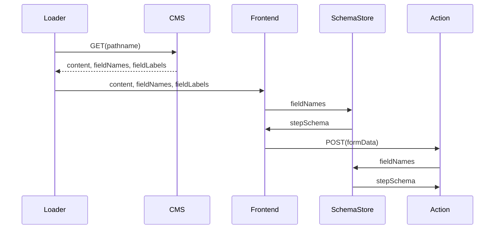
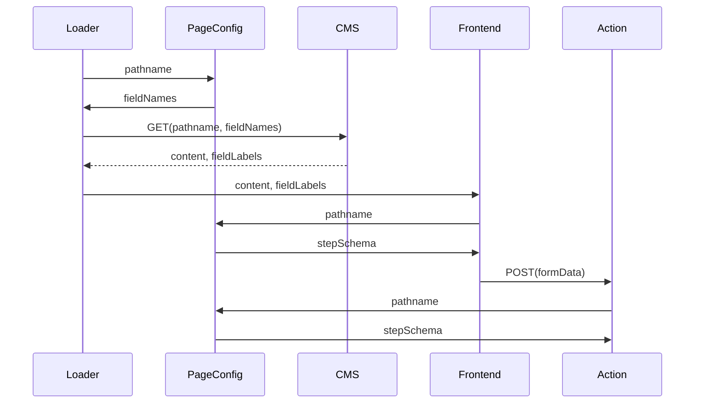

# 13. pageConfig inside application

Date: 2024-10-22

## Status

Proposal

## Context

Currently, the information about what field appears on what page is **solely** encoded in the CMS. In order to render a page, the app has to fetch the content for a given URL from the CMS, which may contain a list of fields and their labels (next to the page content).

#### Terms

- `field`: A user-facing input that appears on a page inside a flow
  - `fieldName`: the name of a field in the form, e.g. `hasAnwalt`
  - `fieldSchema`: Combination of field name and its schema, e.g. `hasAnwalt: z.enum(["yes", "no"]) }`
  - `fieldLabel`: The user-facing string associated
- `stepSchema`: All schemas required for a single page, e.g.:
  ```typescript
  {
    hasAnwalt: z.enum(["yes", "no"]),
    hasContacted: z.enum(["yes", "no"]),
  }
  ```
- `SchemaStore`: A service that can return a `stepSchema` based on a list of `fieldNames`. Our current function is called `validatorForFieldNames()`.

#### Diagram

Both the front- and back-end need the `stepSchema` to validate user input. The following is a rough sequence diagram:



Note that the `fieldNames` are passed from the CMS via the loader + front/back-end into the `SchemaStore`.

#### Downsides

- Resilience: The app **cannot** work without the CMS
- Slow prototyping of new flows, as it requires constant addition of pages to the CMS
- Mental load: Its hard to understand what fields are filled out on what page (requires manually checking the CMS)
- Additional traffic: When the app needs to know about fields on pages, it needs to make an additional request to the CMS (for example in the pruner)
- Because unchecked checkboxes and radio groups are not sent in html forms, we inject a hidden input to "inform" the app that the input _should_ be there (currently affects our `Checkbox`, `RadioGroup` and `TileGroup` components). See this [StackOverflow article](https://stackoverflow.com/a/1992745) for more context.
- In the CMS, field names (`hasAnwalt`, ...) and field types (`radio`, `dropdown`, ...) are hard-coded on each flow page. They need to exactly match the name & schema in the app (but are free inputs with a label `Do not change`). Any mismatch breaks the flow (eg "validation for field "abc" could not be found").

## Proposal

Instead, the app should be the single-source-of-truth for flow configuration, which includes the `stepSchema`. The CMS should serve content _only_ (which of course would include the form labels).

A new `PageConfig` abstraction should be added, that links the `stepId` and `stepSchema` of each page and would replace our current `SchemaStore` (aka `context`/`userInputSchema`):

```typescript
type StepSchema = Record<string, z.ZodType>;
type PageConfig = Record<string, { stepId: string; stepSchema: StepSchema }>;

const pages = {
  anwalt: {
    stepId: "/anwalt",
    stepSchema: { hasAnwalt: z.enum(["yes", "no"]) },
  },
} satisfies PageConfig;
```

#### Diagram

Now, any component can receive a `stepSchema` directly from the `PageConfig` by passing the `pathname`:



#### Note

While not necessary, this could be integrated in our existing xStateConfig:

```typescript
const xStateConfig = {
  states: {
    [pages.anwalt.stepId]: {
      meta: { stepSchema: pages.anwalt.stepSchema },
    },
  },
};
```

## Consequences

### Pros:

- Domain driven architecture: Full decoupling of flow configuration from content
- Reduced mental load when reasoning about form fields and their position inside the flow
- App works without CMS (pruner, prototyping, ...)

### Cons:

- Field names and definition in the CMS still need to match the ones in the app. However, on a mismatch we would "just" have missing labels, rather than full app breakage
- Cleanly moving a field from between existing pages might become more complicated (See below)

### Future consideration

#### Moving form field to another page

While this is rarely done, it would be a bit more complicated due to the separate app & content release:

1. Add form field to new page
2. Trigger content release (the new page wouldn't change as the app is in charge of whats shown)
3. Field is moved to its new location in the `PageConfig`
4. Trigger app release (now the form field will appear on the new page)
5. Remove form field from the old page in CMS

#### Synchronizing form fields

The downside of doubling field names & types could be mitigated by synchronizing the CMS with the app. This could be either done by:

- Publishing the fieldNames via an endpoint that the CMS consumes
- Pushing changes to the CMS on deploy (probably via a simple POST request)
