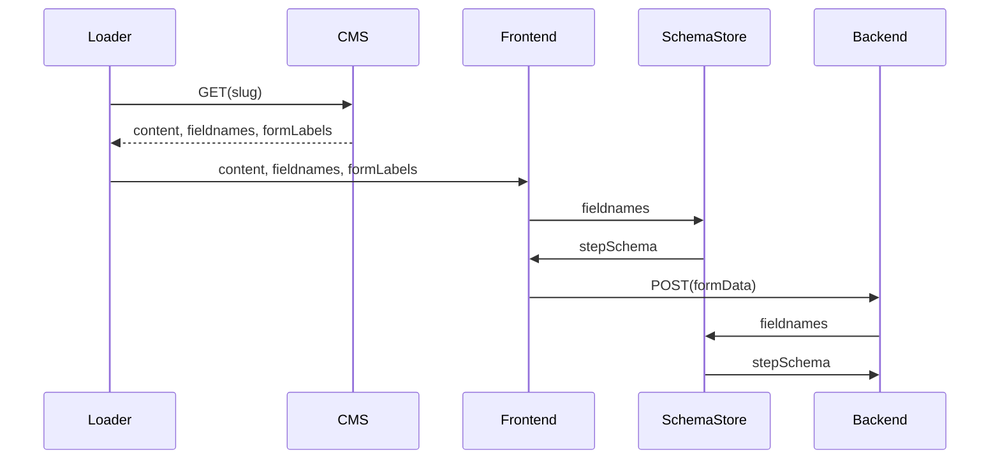
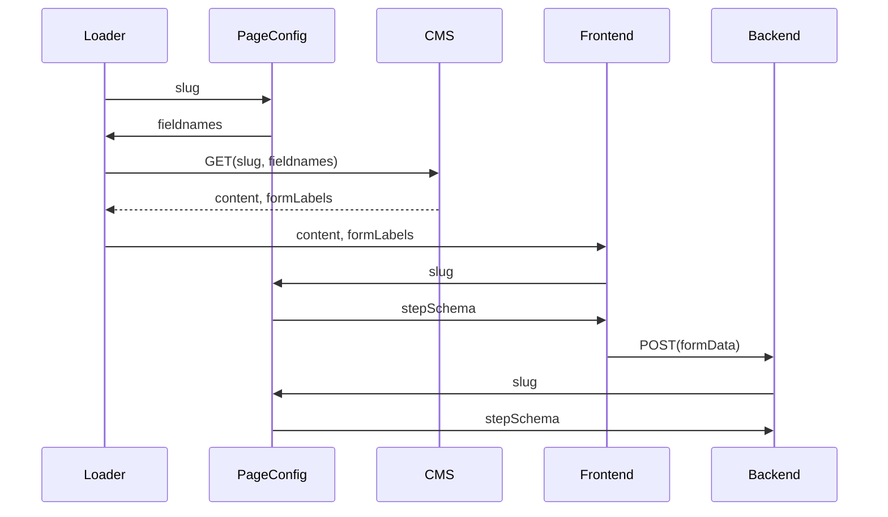

# 13. pageConfig inside application

Date: 2024-10-22

## Status

Accepted

## Context

Currently, the information about what field appears on what page is **solely** encoded in the CMS. In order to render a page, the app has to fetch the content for a given URL from the CMS, which may contain a list of fields and their labels (next to the page content).

#### Terms

- `fieldname`: the name of a field in the form, e.g. `hasAnwalt`
- `fieldSchema`: Combination of fieldname and its schema, e.g. `hasAnwalt: z.enum(["yes", "no"]) }`
- `stepSchema`: All schemas required for a single page, e.g.:
  ```typescript
  {
    hasAnwalt: z.enum(["yes", "no"]) },
    hasContacted: z.enum(["yes", "no"]) },
  }
  ```
- `SchemaStore`: A collection that can return a `stepSchema` based on a list of `fieldnames`. Our current function is called `validatorForFieldnames(fieldnames)`.

#### Diagram



Note that the `fieldnames` are passed from the CMS via the loader and front/back-end into the `SchemaStore`.

#### Downsides

- Its hard to understand where which fields are filled out on what page (requires manually checking the CMS)
- The app **cannot** know why fields where seen when traversing a flow (pruner needs to request the CMS)
- The app **cannot** work without the CMS
- Prototyping new flows requires adding new pages in the CMS
- In the CMS, fieldnames (`hasAnwalt`, ...) and fieldtypes (`radio`, `dropdown`, ...) are hard-coded on each flow page. They need to exactly match the name & schema in the app (but are free inputs with a label `Do not change`).

## Decision

Instead, the app should be the single-source-of-truth (SSOT) for flow configuration, which includes the stepSchema. The CMS should be the source of content _only_ (includes the labels for fields). This is done by the introduction of a new `PageConfig`, that defines each page's `stepId` and `stepSchema` and would replace our current `SchemaStore` (aka `context`/`userInputSchema`):

```typescript
type StepSchema = Record<string, z.ZodType>;
type PageConfig = Record<string, { stepId: string; stepSchema: StepSchema }>;

const pages = {
  anwalt: {
    stepId: "/anwalt",
    stepSchema: { hasAnwalt: z.enum(["yes", "no"]) },
  },
};
```

#### Diagram

Now, any consumer can request a `stepSchema` directly from the app via the `slug`:



#### Note

While not neccessary, his could be integrated in our existing xStateConfig:

```typescript
const xStateConfig = {
  states: {
    [pages.anwalt.stepId]: {
      meta: { stepSchema: pages.anwalt.stepSchema },
    },
  },
};
```

## Consequences

### Pros:

- Full decoupling of domains (flow configuration & content)
- App works without CMS (faster prototyping...)

### Cons:

- Fieldnames and definition in the CMS still need to match the ones in the app
- Cleanly moving a field from between existing pages is more complicated (See below)

### Future consideration

#### Moving a form field between pages

While this is rarely done, it would be a bit more complicated due to the separate app & content release:

1. Add form field to new page
2. Trigger content release (the new page wouldn't change as the app is in charge of whats shown)
3. Field is moved in the app (aka in the `PageConfig`)
4. Trigger app release (now the form field will ONLY appear on the new page)
5. Remove form field from the old page in CMS

#### Syncronizing form fields

The downside could be fully mitigated by synchronizing the app with the CMS. This could be either done by:

- Publishing the fieldnames via an endpoint that the CMS consumes to populate fieldnames
- Pushing changes on deploy to the CMS (probably via a simple POST request)
