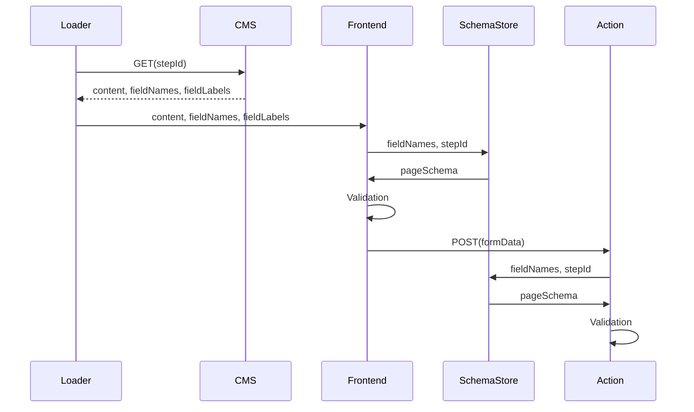
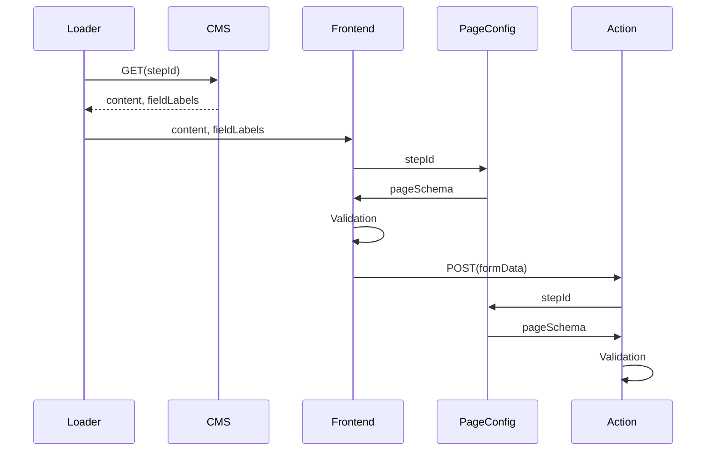

# 22. Field configuration inside app

Date: 2025-03-03

## Status

Proposal

## Context

Currently, the information about what field appears on what page is **solely** saved in the CMS. To render a page, the app has to fetch the content for a given URL from the CMS, which may contain a list of fields and their labels (next to the page content).

#### Terms

- `field`: A user-facing input that appears on a page inside a flow
  - `fieldName`: The name of a field in the form, e.g. `hasLawyer`
  - `fieldSchema`: The schema defining valid field data, e.g. `hasLawyer: z.enum(["yes", "no"])`
  - `fieldLabels`: (optional) UI labels associated with a field or its options, e.g. `Anwalt`, or `{yes: "Ja", no: "Nein"}`
- `pageSchema`: All schemas required for a single page inside a flow, e.g.:
  ```typescript
  {
    hasLawyer: z.enum(["yes", "no"]),
    hasContacted: z.enum(["yes", "no"]),
  }
  ```
- `SchemaStore`: A service that bundles the schemas required to validate the data on a page. Our current implementation `validatorForFieldNames()` takes a list of `fieldNames` and the `stepId` to return a `pageSchema`.

#### Diagram

The `pageSchema` is required both in the front- and back-end to validate user input:



Note that `fieldNames` are passed from the CMS via the loader + front/back-end into the `SchemaStore`.

#### Downsides

- Resilience: The app **cannot** work without the CMS providing the `fieldNames`
- Slow prototyping of new flows, as it requires addition of pages to the CMS even without content
- Mental load: Understanding where a field is filled out requires manually checking in the CMS
- Additional traffic: When the app needs to know about fields on pages, it needs to make an additional request to the CMS (for example in the pruner)
- Additional complexity: Unchecked checkboxes and radio groups are not sent in html forms. To still check for them, we inject a hidden input to allow the backend to verify that such an input _should_ be there (currently affects our `Checkbox`, `RadioGroup` and `TileGroup` components). See this [StackOverflow article](https://stackoverflow.com/a/1992745) for more context.
- In the CMS, field names (`hasLawyer`, ...) and field types (`radio`, `dropdown`, ...) are hard-coded on each flow page. They need to exactly match the name & schema in the app (but are free inputs with a label `Do not change`). Any mismatch breaks the flow (eg "validation for field "abc" could not be found").

## Proposal

The app should be the single-source-of-truth for flow configuration, which includes assigning a `pageSchema` to a url. The CMS should serve content _only_ (which would include the `fieldLabels`).

A new `PageConfig` abstraction links the `stepId` to a `pageSchema`:

```typescript
const userDataSchemas = {
  hasLawyer: z.enum(["yes", "no"]),
  isAdult: z.enum(["yes", "no"]),
};

const pages = {
  anwalt: {
    stepId: "/anwalt",
    pageSchema: z.object({ hasLawyer: userDataSchemas.hasLawyer }),
  },
};
```

Additional benefits: This makes building the validation for a single page trivial (`validatorForFieldNames()`) and allows for very readable per-page validation:

```typescript
const pages = {
  anwaltForAdult: {
    stepId: "/anwalt",
    pageSchema: z
      .object(pick(userDataSchemas, [hasLawyer, isAdult]))
      .refine(
        ({ hasLawyer, isAdult }) =>
          !(isAdult === "yes" && hasLawyer === "no",
          { message: "Under age applicants need a lawyer" }),
      ),
  },
};
```

#### Diagram

Any component can receive a `pageSchema` directly from the `PageConfig` by passing the `stepId`:



Note that the CMS is now only responsible for text!

## Consequences

### Pros:

- Domain driven architecture: Full decoupling of flow configuration from content
- Reduced mental load when reasoning about form fields and their position inside the flow
- App works without CMS (pruner, prototyping, ...)
- Faster staging performance due to reduced lookups
- Simplified per-page validation

### Cons:

- Field names and definition in the CMS still need to match the ones in the app. However, a mismatch just results in missing labels, not breaking the full app

### Future consideration

#### Moving form field to another page

While this is rarely done, the following would need to be done to move a field form one page to another:

1. Add field to new page
2. Trigger content release (the new page wouldn't change as the app is in charge of whats shown)
3. Move field to new location in the app
4. Trigger app release (now the form field will appear on the new page)
5. Remove form field from the old page in CMS

#### Synchronizing form fields

The downside of doubling field names & types could be mitigated by synchronizing the CMS with the app. This could be either done by:

- Publishing the fieldNames via an endpoint that the CMS consumes
- Pushing changes to the CMS on deploy (probably via a simple POST request)
