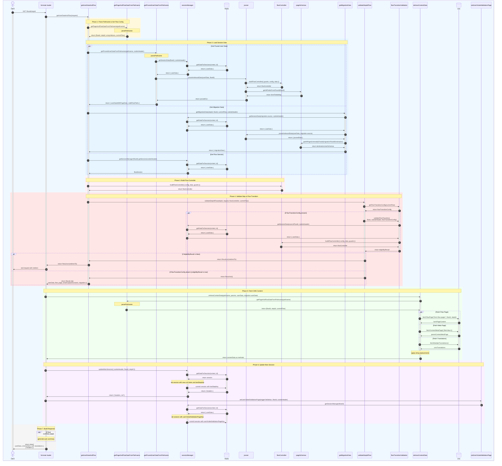

## 1. Formular Page - GET Request (Current Implementation)

```mermaid
sequenceDiagram
    autonumber
    box rgb(240, 248, 255)
        actor client
        participant loader as formular loader
        participant getUserDataAndFlow
        participant getPageAndFlowDataFromPathname
        participant getPrunedUserDataFromPathname
        participant sessionManager
        participant Redis@{"type": "database"}
        participant pruner
        participant flowController
        participant pageSchemas
        participant getMigrationData
        participant validateStepIdFlow
        participant flowTransitionValidation
        participant retrieveContentData
        participant cms@{"type": "database"}
        participant setUserVisitedValidationPage
    end

    client ->> loader: GET /flowId/stepId
        activate client
    loader ->> getUserDataAndFlow: getUserDataAndFlow(request)
        activate loader
        activate getUserDataAndFlow

    %% Phase 1: Parse Pathname & Get Flow Config
    rect rgb(255, 248, 220)
        Note over getUserDataAndFlow,getPageAndFlowDataFromPathname: Phase 1: Parse Pathname & Get Flow Config
        getUserDataAndFlow ->> getPageAndFlowDataFromPathname: getPageAndFlowDataFromPathname(pathname)
            activate getPageAndFlowDataFromPathname
        note over getPageAndFlowDataFromPathname: parsePathname
        getPageAndFlowDataFromPathname ->> getUserDataAndFlow: return {flowId, stepId, arrayIndexes, currentFlow}
            deactivate getPageAndFlowDataFromPathname
    end

    %% Phase 2: Load Session Data
    rect rgb(230, 245, 255)
        Note over getUserDataAndFlow,getMigrationData: Phase 2: Load Session Data

        par Get Pruned User Data
            getUserDataAndFlow ->> getPrunedUserDataFromPathname: getPrunedUserDataFromPathname(pathname, cookieHeader)
                activate getPrunedUserDataFromPathname
            note over getPrunedUserDataFromPathname: parsePathname
            getPrunedUserDataFromPathname ->> sessionManager: getSessionData(flowId, cookieHeader)
                activate sessionManager
            sessionManager ->> Redis: getDataForSession(context, id)
                activate Redis
            Redis ->> sessionManager: return { userData }
                deactivate Redis
            sessionManager ->> getPrunedUserDataFromPathname: return { userData }
                deactivate sessionManager
            getPrunedUserDataFromPathname ->> pruner: pruneIrrelevantData(userData, flowId)
                activate pruner
            pruner ->> flowController: buildFlowController({ guards, config, data })
                activate flowController
            flowController ->> pruner: return flowController
                deactivate flowController
            pruner ->> pageSchemas: getAllFieldsFromFlowId(flowId)
                activate pageSchemas
            pageSchemas ->> pruner: return formFieldsMap
                deactivate pageSchemas
            pruner ->> getPrunedUserDataFromPathname: return prunedOut
                deactivate pruner
            getPrunedUserDataFromPathname ->> getUserDataAndFlow: return { userDataWithPageData, validFlowPaths }
                deactivate getPrunedUserDataFromPathname

        and Get Migration Data
            getUserDataAndFlow ->> getMigrationData: getMigrationData(stepId, flowId, currentFlow, cookieHeader)
                activate getMigrationData
            getMigrationData ->> sessionManager: getSessionData(migration.source, cookieHeader)
                activate sessionManager
            sessionManager ->> Redis: getDataForSession(context, id)
                activate Redis
            Redis ->> sessionManager: return { userData }
                deactivate Redis
            sessionManager ->> getMigrationData: return { userData }
                deactivate sessionManager
            getMigrationData ->> pruner: pruneIrrelevantData(userData, migration.source)
                activate pruner
            pruner ->> getMigrationData: return { prunedData }
                deactivate pruner
            getMigrationData ->> pageSchemas: getAllPageSchemaByFlowId(migrationFlowIdDestination)
                activate pageSchemas
            pageSchemas ->> getMigrationData: return destinationUserSchemas
                deactivate pageSchemas
            getMigrationData ->> getUserDataAndFlow: return { migrationData }
                deactivate getMigrationData

        and Get Flow Session
            getUserDataAndFlow ->> sessionManager: getSessionManager(flowId).getSession(cookieHeader)
                activate sessionManager
            sessionManager ->> Redis: getDataForSession(context, id)
                activate Redis
            Redis ->> sessionManager: return { userData }
                deactivate Redis
            sessionManager ->> getUserDataAndFlow: flowSession
                deactivate sessionManager
        end
    end

    %% Phase 3: Build Flow Controller
    rect rgb(255, 240, 245)
        Note over getUserDataAndFlow,flowController: Phase 3: Build Flow Controller
        getUserDataAndFlow ->> flowController: buildFlowController({ config, data, guards })
            activate flowController
        flowController ->> getUserDataAndFlow: return flowController
            deactivate flowController
    end

    %% Phase 4: Validate Step & Flow Transition
    rect rgb(255, 230, 230)
        Note over getUserDataAndFlow,flowTransitionValidation: Phase 4: Validate Step & Flow Transition
        getUserDataAndFlow ->> validateStepIdFlow: validateStepIdFlow(stepId, request, flowController, currentFlow)
            activate validateStepIdFlow
        validateStepIdFlow ->> flowTransitionValidation: getFlowTransitionConfig(currentFlow)
            activate flowTransitionValidation
        flowTransitionValidation ->> validateStepIdFlow: return flowTransitionConfig

        opt if flowTransitionConfig present
            validateStepIdFlow ->> flowTransitionValidation: validateFlowTransition(<br/>flows, cookieHeader, flowTransitionConfig)
            flowTransitionValidation ->> sessionManager: getSessionData(sourceFlowId, cookieHeader)
                activate sessionManager
            sessionManager ->> Redis: getDataForSession(context, id)
                activate Redis
            Redis ->> sessionManager: return { userData }
                deactivate Redis
            sessionManager ->> flowTransitionValidation: return { userData }
                deactivate sessionManager
            flowTransitionValidation ->> flowController: buildFlowController({ config, data, guards })
                activate flowController
            flowController ->> flowTransitionValidation: return flowController
                deactivate flowController
            flowTransitionValidation ->> validateStepIdFlow: return eligibilityResult
                deactivate flowTransitionValidation
        end

        alt if eligibilityResult is false
            validateStepIdFlow ->> getUserDataAndFlow: return Result.err(redirectTo)
            getUserDataAndFlow ->> loader: return Result.err(redirectTo)
            loader ->> client: end request with redirect
        else if flowTransitionConfig absent || eligibilityResult is true
            validateStepIdFlow ->> getUserDataAndFlow: return Result.ok()
                deactivate validateStepIdFlow
            getUserDataAndFlow ->> loader: return Result.ok({ <br/>userData, flow, page, emailCaptureConsent, migration })
        end
            deactivate getUserDataAndFlow
    end

    %% Phase 5: Fetch CMS Content
    rect rgb(240, 255, 240)
        Note over loader,cms: Phase 5: Fetch CMS Content
        loader ->> retrieveContentData: retrieveContentData(pathname, params, userData, migration.userData)
            activate retrieveContentData
        retrieveContentData ->> getPageAndFlowDataFromPathname: getPageAndFlowDataFromPathname(pathname)
            activate getPageAndFlowDataFromPathname
        note over getPageAndFlowDataFromPathname: parsePathname
        getPageAndFlowDataFromPathname ->> retrieveContentData: return {flowId, stepId, currentFlow}
            deactivate getPageAndFlowDataFromPathname

        par Fetch Flow Page
            retrieveContentData ->> cms: fetchFlowPage("form-flow-pages", flowId, stepId)
                activate cms
            cms ->> retrieveContentData: formPageContent
        and Fetch Meta Page
            retrieveContentData ->> cms: fetchContentMetaPage({ filterValue })
            cms ->> retrieveContentData: parentContentMetaPage
        and Fetch Translations
            retrieveContentData ->> cms: fetchMultipleTranslations()
            cms ->> retrieveContentData: cmsTranslations
                deactivate cms
        end

        note over retrieveContentData: apply string replacements
        retrieveContentData ->> loader: return contentData as methods
            deactivate retrieveContentData
    end

    %% Phase 6: Update Main Session
    rect rgb(250, 240, 255)
        Note over loader,setUserVisitedValidationPage: Phase 6: Update Main Session
        loader ->> sessionManager: updateMainSession({ cookieHeader, flowId, stepId })
            activate sessionManager
        sessionManager ->> Redis: getDataForSession(context, id)
            activate Redis
        Redis ->> sessionManager: return session
        note over sessionManager: set session with new csrf token and lastStepKey
        sessionManager ->> Redis: commit session with lastStepKey
        Redis ->> sessionManager: return { headers }
            deactivate Redis
        sessionManager ->> loader: return { headers, csrf }
            deactivate sessionManager

        loader ->> setUserVisitedValidationPage: setUserVisitedValidationPage(triggerValidation, flowId, cookieHeader)
            activate setUserVisitedValidationPage
        setUserVisitedValidationPage ->> sessionManager: getSessionManager(flowId)
            deactivate setUserVisitedValidationPage
            activate sessionManager
        sessionManager ->> Redis: getDataForSession(context, id)
            activate Redis
        Redis ->> sessionManager: return { userData }
        note over sessionManager: set session with userVisitedValidationPageKey
        sessionManager ->> Redis: commit session with userVisitedValidationPageKey
            deactivate Redis
            deactivate sessionManager
    end

    %% Phase 7: Build Response
    rect rgb(245, 245, 245)
        Note over loader: Phase 7: Build Response
        opt if final summary page
            note over loader: generate auto summary
        end
        loader ->> client: return data({ <br/>userData, cmsContent, csrf, translations }, <br/>{ headers })
    end

    deactivate loader
    deactivate client
```
