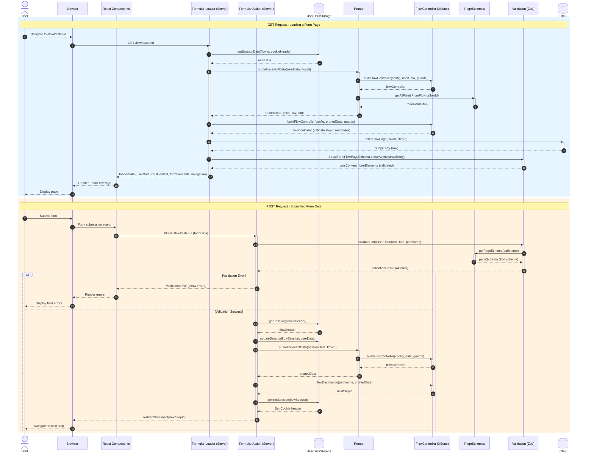

# FormFlowPage - High Level Data Flow

```mermaid
sequenceDiagram
    autonumber
    actor User
    participant Browser
    participant ReactComponents as React Components
    participant Loader as Formular Loader (Server)
    participant Action as Formular Action (Server)
    participant UserDataStorage@{"type": "database", "label": "UserDataStorage (Redis)"}
    participant Pruner
    participant FlowController as FlowController (XState)
    participant PageSchemas
    participant Validation as Validation (Zod)
    participant CMS@{"type": "database", "label": "Strapi CMS"}

    rect rgb(230, 245, 255)
        Note over User,CMS: GET Request - Loading a Form Page
        User ->> Browser: Navigate to /flowId/stepId
        Browser ->> Loader: GET /flowId/stepId
        activate Loader

        Loader ->> UserDataStorage: getSessionData(flowId, cookieHeader)
        activate UserDataStorage
        UserDataStorage -->> Loader: userData
        deactivate UserDataStorage

        Loader ->> Pruner: pruneIrrelevantData(userData, flowId)
        activate Pruner
        Pruner ->> FlowController: buildFlowController(config, userData, guards)
        activate FlowController
        FlowController -->> Pruner: flowController
        deactivate FlowController
        Pruner ->> PageSchemas: getAllFieldsFromFlowId(flowId)
        activate PageSchemas
        PageSchemas -->> Pruner: formFieldsMap
        deactivate PageSchemas
        Pruner -->> Loader: prunedData, validFlowPaths
        deactivate Pruner

        Loader ->> FlowController: buildFlowController(config, prunedData, guards)
        activate FlowController
        FlowController -->> Loader: flowController (validate stepId reachable)
        deactivate FlowController

        Loader ->> CMS: fetchFlowPage(flowId, stepId)
        activate CMS
        CMS -->> Loader: strapiEntry (raw)
        deactivate CMS
        Loader ->> Validation: StrapiFormFlowPageSchema.parseAsync(strapiEntry)
        activate Validation
        Validation -->> Loader: cmsContent, formElements (validated)
        deactivate Validation

        Loader -->> ReactComponents: loaderData (userData, cmsContent, formElements, navigation)
        deactivate Loader

        ReactComponents -->> Browser: Render FormFlowPage
        Browser -->> User: Display page
    end

    rect rgb(255, 243, 224)
        Note over User,CMS: POST Request - Submitting Form Data
        User ->> Browser: Submit form
        Browser ->> ReactComponents: Form submission event
        ReactComponents ->> Action: POST /flowId/stepId (formData)
        activate Action

        Action ->> Validation: validateFormUserData(formData, pathname)
        activate Validation
        Validation ->> PageSchemas: getPageSchema(pathname)
        activate PageSchemas
        PageSchemas -->> Validation: pageSchema (Zod schema)
        deactivate PageSchemas
        Validation -->> Action: validationResult (ok/error)
        deactivate Validation

        alt Validation Error
            Action -->> ReactComponents: validationError (show errors)
            ReactComponents -->> Browser: Render errors
            Browser -->> User: Display field errors
        else Validation Success
            Action ->> UserDataStorage: getSession(cookieHeader)
            activate UserDataStorage
            UserDataStorage -->> Action: flowSession
            Action ->> UserDataStorage: updateSession(flowSession, userData)
            deactivate UserDataStorage

            Action ->> Pruner: pruneIrrelevantData(sessionData, flowId)
            activate Pruner
            Pruner ->> FlowController: buildFlowController(config, data, guards)
            activate FlowController
            FlowController -->> Pruner: flowController
            deactivate FlowController
            Pruner -->> Action: prunedData
            deactivate Pruner

            Action ->> FlowController: flowDestination(pathname, prunedData)
            activate FlowController
            FlowController -->> Action: nextStepId
            deactivate FlowController

            Action ->> UserDataStorage: commitSession(flowSession)
            activate UserDataStorage
            UserDataStorage -->> Action: Set-Cookie header
            deactivate UserDataStorage

            Action -->> Browser: redirectDocument(nextStepId)
            deactivate Action
            Browser -->> User: Navigate to next step
        end
    end
```
