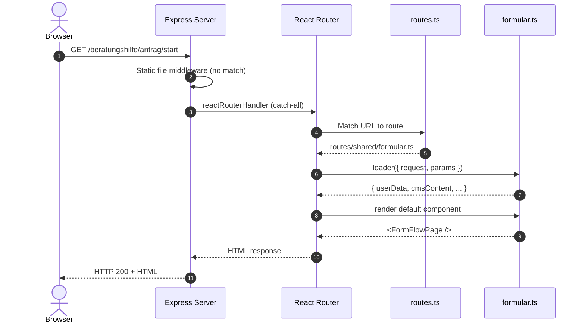
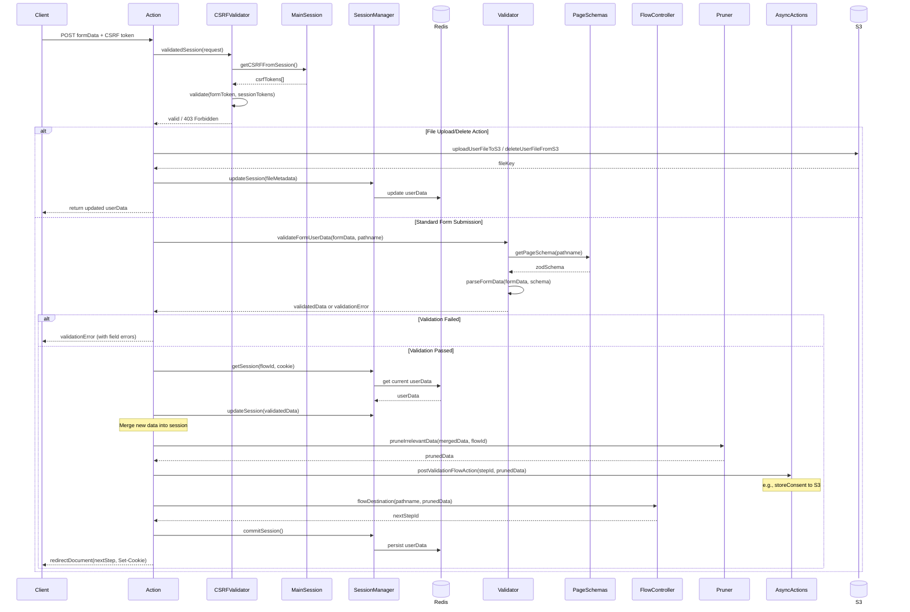
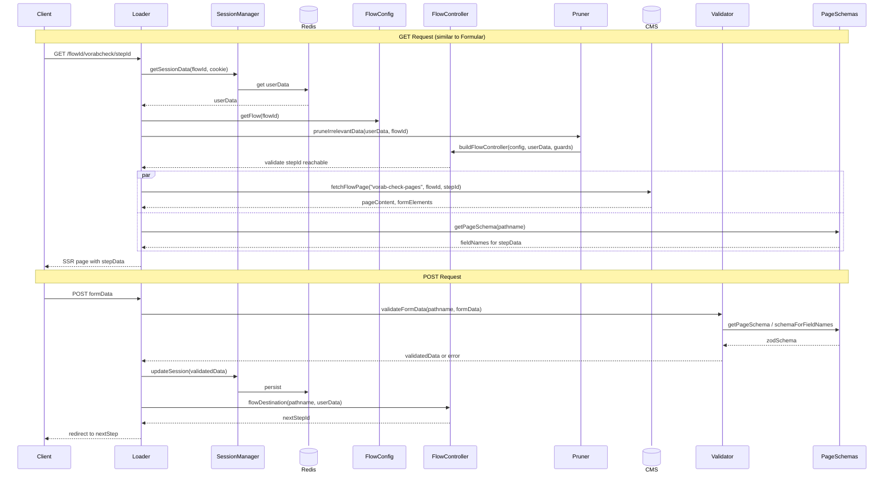
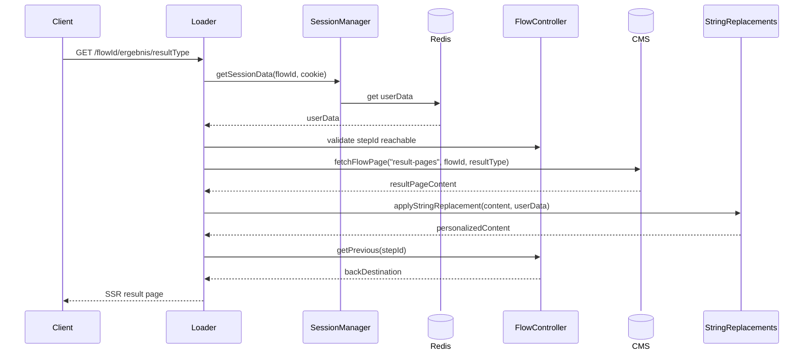
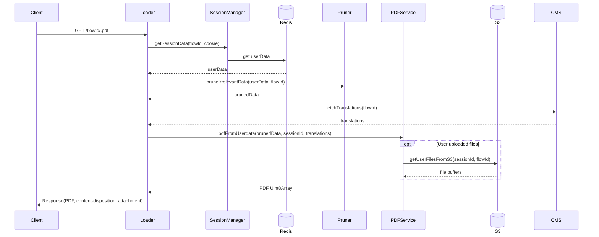
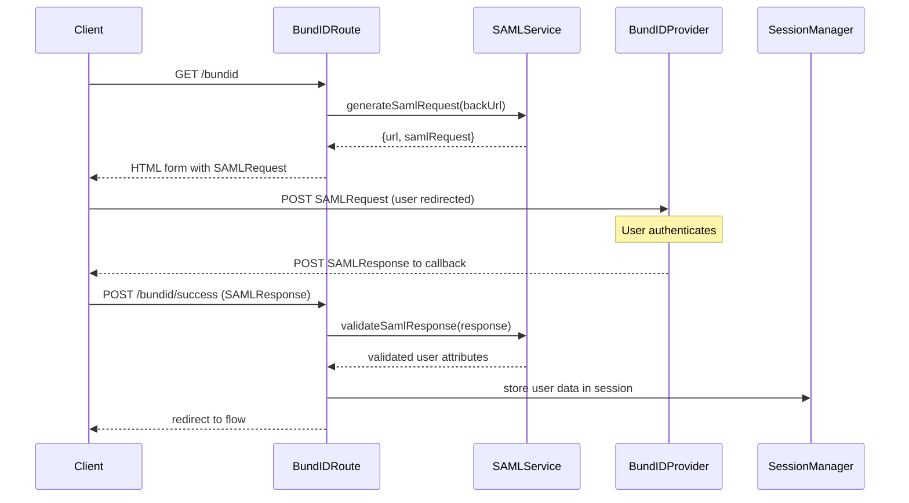

# Application Data Flow - Sequence Diagrams

## 1. Initial Request Handling

---

## 2. Formular Page - POST Request (Form Submission) - TO BE UPDATED

---

## 3. Vorabcheck Page - GET/POST Request - TO BE UPDATED

---

## 4. Result Page - GET Request - TO BE UPDATED

---

## 5. PDF Download - TO BE UPDATED

---

## 6. BundID Authentication Flow - TO BE UPDATED

