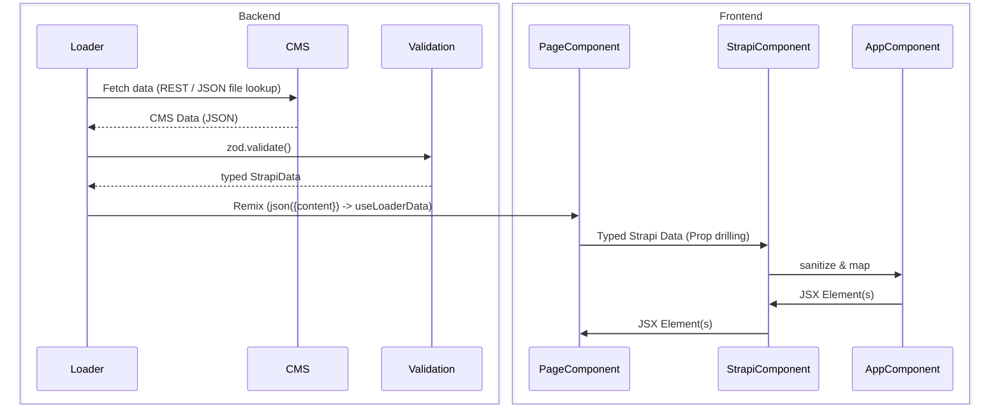

### Data Flow

```mermaid
sequenceDiagram

box Backend
participant Loader
participant CMS
participant Validation
end

box Frontend
participant PageComponent
participant StrapiComponent
participant AppComponent
end

Loader->>CMS: Fetch data (REST / JSON file lookup)
CMS-->>Loader: CMS Data (JSON)
Loader->>Validation: zod.validate()
Validation-->>Loader: typed StrapiData
Loader->>PageComponent: Remix (json({content}) -> useLoaderData)
PageComponent->>StrapiComponent: Typed Strapi Data (Prop drilling)
StrapiComponent->>AppComponent: sanitize & map
AppComponent->>StrapiComponent: JSX Element(s)
StrapiComponent->>PageComponent: JSX Element(s)
```
