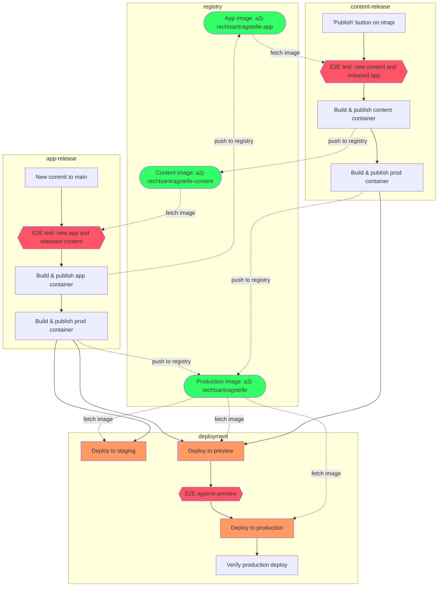

### Deployment

App and content are deployed separately from each other. Refer to the following flow chart:

```mermaid
flowchart TD

    classDef e2eTest fill:#f56
    classDef deploy fill:#f96
    classDef artifact fill:#3f6

    subgraph registry
        latest_published_app([App image: a2j-rechtsantragstelle-app]):::artifact
        latest_published_content([Content image: a2j-rechtsantragstelle-content]):::artifact
        latest_published_prod([Production image: a2j-rechtsantragstelle]):::artifact
    end

    subgraph app-release
    commit_to_main[New commit to main] --> app_e2e
    app_e2e{{E2E test: new app and released content}}:::e2eTest --> build_app_container
    build_app_container -.push to registry.-> latest_published_app

    build_app_container[Build & publish app container] --> build_prod_container_with_new_app
    build_prod_container_with_new_app[Build & publish prod container] -.push to registry.-> latest_published_prod
    end

    subgraph content-release
    publish_content['Publish' button on strapi] --> content_e2e
    latest_published_app -.fetch image.-> content_e2e
    content_e2e{{E2E test: new content and released app}}:::e2eTest --> build_content_container
    build_content_container[Build & publish content container] -.push to registry.-> latest_published_content
    build_content_container --> build_prod_container_with_new_content
    build_prod_container_with_new_content[Build & publish prod container] -.push to registry.-> latest_published_prod
    end

    subgraph deployment
    latest_published_prod -.fetch image.-> deploy_to_staging:::deploy
    build_prod_container_with_new_app --> deploy_to_staging[Deploy to staging]
    build_prod_container_with_new_app --> deploy_to_preview:::deploy
    latest_published_content -.fetch image.-> app_e2e
    latest_published_prod -.fetch image.-> deploy_to_preview
    build_prod_container_with_new_content --> deploy_to_preview
    deploy_to_preview[Deploy to preview] --> e2e_against_preview
    e2e_against_preview{{E2E against preview}}:::e2eTest --> deploy_to_production
    latest_published_prod -.fetch image.-> deploy_to_production:::deploy
    deploy_to_production[Deploy to production] --> production_check[Verify production deploy]

    end

```
