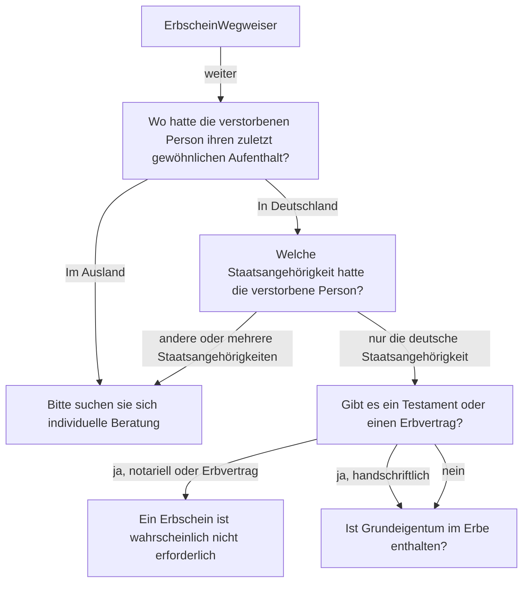

# Nachlass Flow

```mermaid
flowchart TD


ErbscheinWegweiser
Aufenthalt[Wo hatte die verstorbenen Person ihren zuletzt gewöhnlichen Aufenthalt?]
EndeIndividuelleBeratung[Bitte suchen sie sich individuelle Beratung]
Staatsangehörigkeit[Welche Staatsangehörigkeit hatte die verstorbene Person?]
Testament[Gibt es ein Testament oder einen Erbvertrag?]
KeinErbschein[Ein Erbschein ist wahrscheinlich nicht erforderlich]
Grundeigentum[Ist Grundeigentum im Erbe enthalten?]

ErbscheinWegweiser -->|weiter| Aufenthalt
Aufenthalt -->|In Deutschland| Staatsangehörigkeit
Aufenthalt -->|Im Ausland| EndeIndividuelleBeratung
Staatsangehörigkeit -->|nur die deutsche Staatsangehörigkeit| Testament
Staatsangehörigkeit -->|andere oder mehrere Staatsangehörigkeiten| EndeIndividuelleBeratung
Testament -->|ja, notariell oder Erbvertrag| KeinErbschein
Testament -->|ja, handschriftlich| Grundeigentum
Testament -->|nein| Grundeigentum

```
